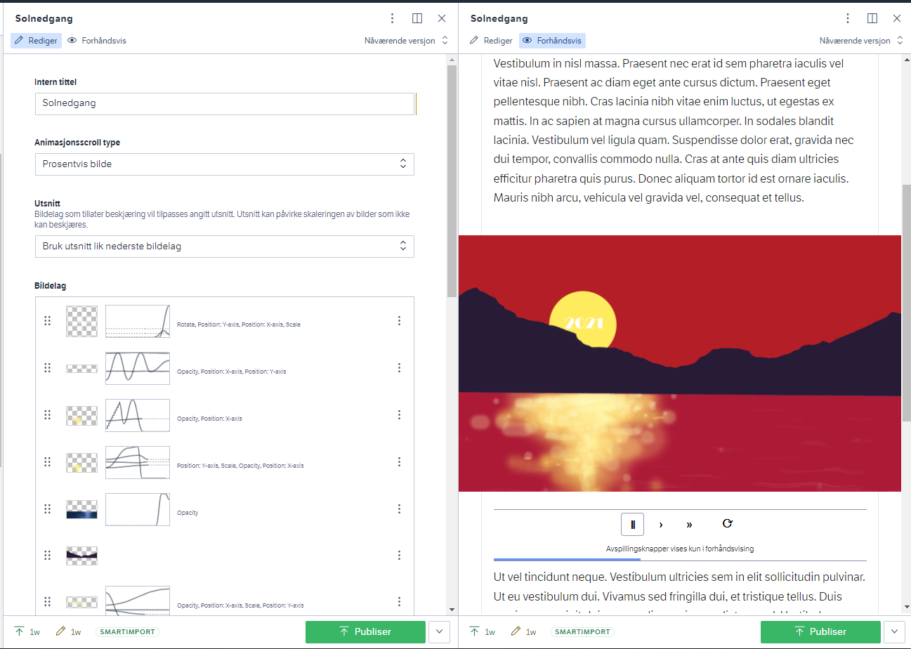
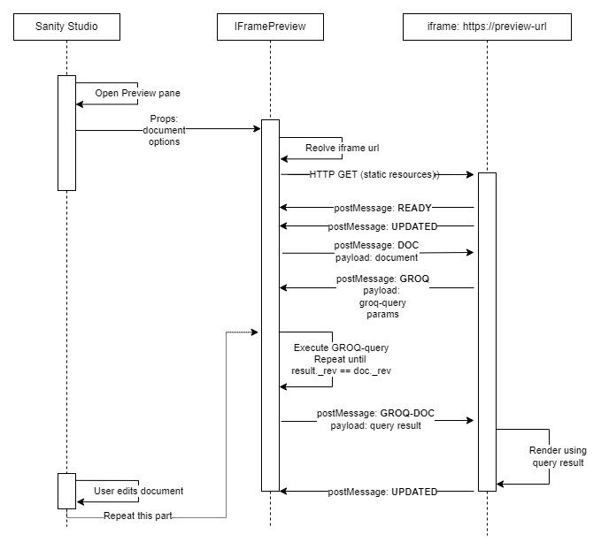

# @nrk/nrkno-iframe-preview-api

Framework-agnostic library for interacting with [IFramePreview](../sanity-plugin-nrkno-iframe-preview/README.md)
in Sanity Studio.

`initPreview` should be used by the app rendered inside the iframe. 

See docs in [@nrk/sanity-plugin-nrkno-iframe-preview](../sanity-plugin-nrkno-iframe-preview/README.md) for a detailed description of how this library works.


_Figure 1: Sanity form editor in the left pane, IFramePreview showing iframe content in the right pane._

# Installation

`npm install --save @nrk/nrkno-iframe-preview-api`

# Usage

Refer to [jsdocs for each config-param](src/types.ts) for details.

## Basic usage

```ts
import { initPreview } from '@nrk/nrkno-iframe-preview-api'

// Somewhere after page load
const unloadPreview = initPreview<QueryResult | undefined>(
    {
      // _rev field is REQUIRED. See note about _rev field below.
      // query passed as the first param to sanityClient.fetch
      groqQuery: "* [_type='my-page' && _id == $id]{_rev, ...}[0]",
      
      // query params are passed as the second param to sanityClient.fetch,
      // and can be used in the groqQuery (ie $id) 
      queryParams: (doc) => ({id: doc._id}), // default
    },
    (data) => {
      if (!data) {
        //we will end up in here if the query has no data and
        //during inital load becuase initialData param is undefined.
        return;
      }
      // When this page is loaded by IFramePreview in Sanity Studio,
      // this callback will receive updated query-data whenever the Studio makes edits.
      // Use it to update your page in whatever way makes sense.
    }
)


// when the component that uses the preview is unmounted, ensure to call
unloadPreview()
```

## Advanced usage

```ts
import { initPreview } from '@nrk/nrkno-iframe-preview-api'

// assume the page is server side rendered, and prepobulated with data
const prefetchedData = {_rev: '123', _id: '2'}

// Somewhere after page load
const unloadPreview = initPreview<QueryResult | undefined>(
    {
      sanityClientVersion: "2021-06-01",
      groqQuery: "* [_type='my-page' && slug._current == $slug]{_rev, ...}[0]",
      queryParams: (doc) => ({slug: doc.slug._current}),
      initialData: prefetchedData,
      origin: 'https://my-sanity-studio.example'
    },
    (data) => {
      if (!data) {
        return;
      }
      // update app
    }
)


// whenever the component that uses the preview is unmounted, ensure to call
unloadPreview()
```

## Use Studio document as is

Omit groqQuery param completly. 

Now data will always be the document used by the studio (possibly passed through by mapDocument in IFramePreview).

```ts
import { initPreview } from '@nrk/nrkno-iframe-preview-api'

// Somewhere after page load
const unloadPreview = initPreview<QueryResult | undefined>({},
    (data) => {
      if (!data) {
        return;
      }
      // data will be what the Sanity studio has; no groq queries will be execuded.
    }
)

// when the component that uses the preview is unmounted, ensure to call
unloadPreview()
```

## Use with React

```tsx
import React, {useState, useEffect} from 'react'
import { initPreview } from '@nrk/nrkno-iframe-preview-api'

export function MyApp(props: {initialData: QueryResult, enabledPreview: boolean}) {
  const [appState, setAppState] = useState<QueryResult>(props.initialData)
  
  useEffect(() => {
    if (!props.enabledPreview) {
      return 
    }
    // cleanup function is returned to React
    return initPreview<QueryResult | undefined>(
      {
        groqQuery: "* [_type='my-page' && _id == $id]{_rev, ...}[0]",
        queryParams: (doc) => ({id: doc._id}),
        initialData
      },
      (data) => {
        if (!data) {
          return;
        }
        setAppState(data)
      }
    );
  }, [] /* only run effect on mount */)
  
  // updates whenever we get data from Sanity studio
  return <div>{JSON.stringify(appState)}</div>
}

```

### About the _rev field
All Sanity documents contains a _rev field. It changes everytime the document changes, and is unique.

For Sanity Studio to know when the groq-query returns up-to-date data, IFramePreview will
compare the _rev field in the current studio document, with the _rev field in the query.

Therefore the `groqQuery` MUST contain the _rev-field projected at the top level,
and it should correspond to the _rev field of the document edited in the studio.

It has to be explicitly projected, so it can be validated without running the query.
Queries without projections can be easily rewritten like this:

* Query without projection and _rev field: `*[_id == $id][0]`
* Query WITH projection and _rev field: `*[_id == $id][0]{_rev, ...}`

If the query contains no _rev an error will be thrown.

## Sequence diagram for dataflow


_Figure 2: Sequence diagram for dataflow between Sanity Studio and the iframe_

# Develop

### Test

In this directory

```bash
npm run build
npm link
```

```bash
cd /path/to/your/render/app
npm link  @nrk/sanity-plugin-nrkno-iframe-preview
```

Remember to use localhost url in the Studio to test the IFramePreview component with the app using the linked lib.
