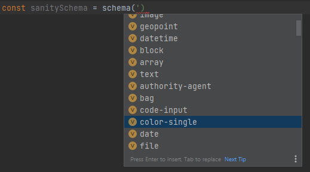
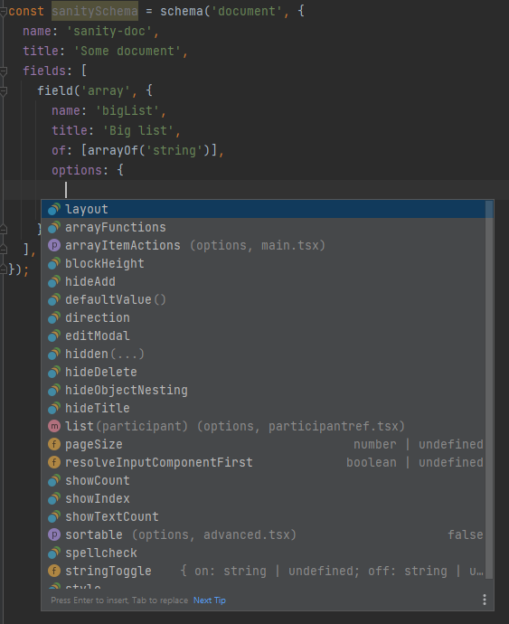
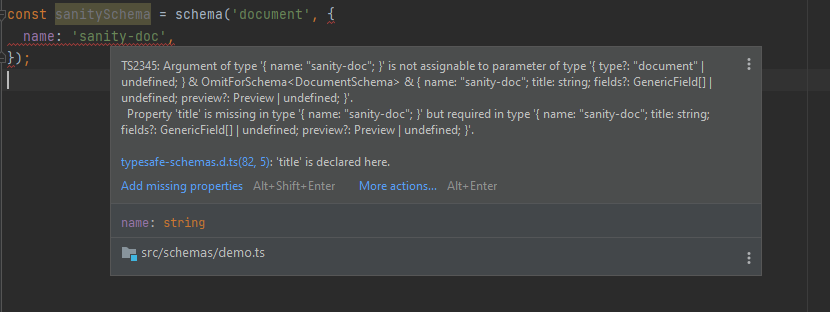
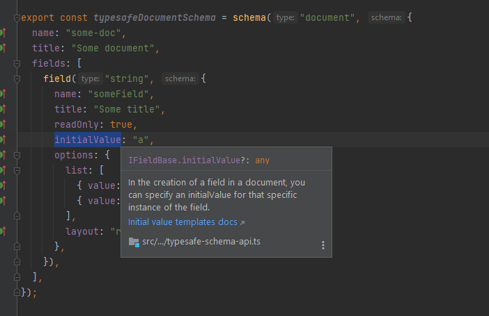

# @nrk/nrkno-sanity-typesafe-schemas

# Sanity Typesafe Schemas

Utility functions to ease Sanity schema development:

- `schema(typeName, schemaDefinition)`: used to define schemas that is consumed by `createSchema`.
- `field(typeName, fieldDefinition)`: used to define fields for `document`, `object`, `file` and `image` schemas.
- `arrayOf(typeName, arrayMemberDefinition)`: used to define of-entries in `array` schemas.
- `typed<T>(anything)`: passthrough function to provide inline types in json objects.
- `checkSchema<T>(anything)`: safeguard function that ensures an interface contains all field-names used in a schema 
- `forType<T>(anything)`: utility function meant to be used with `checkSchema` 

## API design goals

- Typesafe Sanity schemas (and with that, autocompletion)
- Feature discovery of built-in Sanity features (types, options, validations)
- Breadcrumb-trails to relevant Sanity docs
- Feature discovery & documentation of extension types & features (custom input-resolver options, reusable schema-types etc.)
- Decrease time from idea to finished schema for developers, by embracing the above.
- Opt-in. Ie, this can be sprinkled into an existing codebase to gradually add type safety to schemas.
- Minimal runtime footprint. Should not mess with the schema provided by the developer.

See [the-gist-of-it-all.ts](src/examples/the-gist-of-it-all.ts) for a scaled down version of how the helper functions work.

### Type discovery



### Feature discovery



### Typesafety



### Documentation



# Installation

`npm install --save @nrk/nrkno-sanity-typesafe-schemas`

or

`yarn add @nrk/nrkno-sanity-typesafe-schemas`

# Usage

```ts
import { field, schema } from '@nrk/nrkno-sanity-typesafe-schemas';

export const typesafeDocumentSchema = schema('document', {
  name: 'some-doc',
  title: 'Some document',
  fields: [
    field('string', {
      name: 'someField',
      title: 'Some title',
      initialValue: 'a',
      options: {
        list: [
          { value: 'a', title: 'A' },
          { value: 'b', title: 'B' },
        ],
        layout: 'radio',
      },
    }),
  ],
});

//@ts-expect-error schema is not correctly defined
const withErrorSchema = schema('string', {});
```

See [code examples](src/examples) for more.

## Extending Sanity schemas

Use [TypeScript declaration merging](https://www.typescriptlang.org/docs/handbook/declaration-merging.html)
to extend the types under `@nrk/nrkno-sanity-typesafe-schemas`:

```ts
// document-extension.ts
declare module '@nrk/nrkno-sanity-typesafe-schemas' {
  // adds field 'document' schemas
  interface DocumentSchema {
    custom?: boolean;
  }
}

// number-extension.ts
import '@nrk/nrkno-sanity-typesafe-schemas';
declare module '@nrk/nrkno-sanity-typesafe-schemas' {
    // adds the custom option to 'number' schemas (Number already has options, so we extend the NumberOption)
    interface NumberOptions {
       custom?: boolean;
    }
}

// somewhere using typesafe helpers
export const typesafeDocumentSchema = schema('document', {
    /* omitted */
   custom: true, // custom is now a valid option for all document schemas
});

export const typesafeNumberSchema = schema('document', {
    /* omitted */
    options: {
        custom: true, // custom is now a valid option for all number schemas
    },
});
```

A list of all extendable types can be found in [index.ts](src/index.ts). 

## Adding reusable schema types

Define your schema type, and use [TypeScript declaration merging](https://www.typescriptlang.org/docs/handbook/declaration-merging.html)
to extend `SchemaDirectory` in `@snorreeb/sanity-typesafe-schemas`:

```ts
// special-string-schema.ts
import { StringSchema } from '@nrk/nrkno-sanity-typesafe-schemas';
export type SpecialStringSchema = Omit<StringSchema, 'type'> & {
  type: 'special-string';
  options: {
    special: string;
  };
};

// schema-directory-extension.ts
import '@nrk/nrkno-sanity-typesafe-schemas';
declare module '@nrk/nrkno-sanity-typesafe-schemas' {
  interface SchemaDirectory {
    'special-string': SpecialStringSchema;
  }
}

// somewhere using typesafe helpers
export const specialStringSchema = schema(
  'special-string', // special-string is now a valid, autocompletable type
  {
    /* omitted */
  }
);
```

## Escape hatches

### Defining ad-hoc types without extending anything

The `''` string is a general escape hatch that still provides some safety. `undefined` and `null`will also work.

Use alongside the `typed` generic helper function, to define inline types.

```ts
import { schema, typed } from '@snorreeb/sanity-typesafe-schemas';

export const stringSchemaUsedByNameSomewhereElse = schema('', {
  type: 'string', // when using '', type must be provided here
  name: 'this-name-is-used-in-another-schema',
  title: 'Custom stringtype for whatever reason',
  inputComponent: () => 'Render me softly',
  options: typed<{ customOption: boolean }>({
    customOption: true,
  }),
});

// ...

export const schemaUsingTheAbove = schema('', {
  type: stringSchemaUsedByNameSomewhereElse.name,
  title: 'New title',
  name: 'type-pointing-to-another-type',
});
```

### Force `undefined` title

Title is optional in Sanity Studio, but will result in console.log warnings if omitted.
Therefore, it is required by the schema-helpers.

To set an undefined title anyway, hack-cast it:

```ts
const mySchema = schema('object', {
  title: undefined as unknown as string,
});
```

## Runtime footprint

Compiled to javascript, the helper functions look like this:

```js
function schema(type, schema) {
  return { type, ...schema };
}

function field(type, schema) {
  return { type, ...schema };
}

function arrayOf(type, schema) {
  return { type, ...schema };
}

function typed(anything) {
  return anything;
}
```

Ie, they are basically an identity functions with no overhead.

## Bonus feature: checkSchema

It is often useful to have the _stored_ type of a Sanity document available in the studio, so it can
be used in custom components, hidden-functions, validation-context or similar.

A common problem then, is that it is easy to forget to update the interface after adding a field to schema.
To rectify this slightly, the checkSchema helper-function can be used.

### Example

```ts
import { schema, field, checkSchema, forType } from '@snorreeb/sanity-typesafe-schemas';

// as const narrows string to 'my-type' literal
const type = 'my-type' as const; 

interface SchemaType {
    _type: typeof type;
    field1: string;
    field2: string;
}

export const mySchema = schema('object', {
    name: type,
    fields: [
        field('datetime', {
            name: 'field1', // field automatically narrows name from string to 'field1' literal type
            // intellisense for datetime-properties
        }),
        {
            name: 'field2' as const, // need const here, to narrow type from string to 'field1' literal
            type: 'string',
        },
    ],
});

// this will fail to compile if a new field is added to mySchema without also adding it in SchemaType 
// Note: it does NOT check that schema-field types correspond with interface types
checkSchema(forType<SchemaType>(), mySchema);
```

See [src/examples/check-schema.ts](src/examples/check-schema.ts) for details.

## FAQ

### Why are Sanity schema types partially reimplemented?

Types in `@sanity/types` are the _runtime_ definition of schemas, obtained
after passing schema-definitions to `createSchema`.

The types we want when defining schemas are subtly different and has more optionality and must allow for
extension. Some of the `@sanity/types` ae also to wide to be useful for autocompletion.

Therefore, types are reimplemented to resemble the [Sanity schema documentation](https://www.sanity.io/docs/schema-types),
in most places.

### Why not use Schema types directly?

It is tempting to think this "just work":

```ts
const docSchema: DocumentSchema = {
  type: 'document',
  name: 'my-schema',
  title: 'My document',
  fields: [
    {
      // autocomplete all the things :fingers-crossed:
    },
  ],
};
```

This works fine for _schemas_. In fact, feel free to use the
exported Schema-types in this repository like this if you like.

However, for _fields_, this becomes tricky, when a union type is used to describe all possible
field-types: `fields: UnionOfSchemas[]`.

First, until the discriminator type-field is provided, the autocomplete-listing is overwhelming,
showing all possible fields for all possible schemas.

Second, even with the discriminator type-field, autocomplete in IDE's
becomes unreliable for options and other type-fields that are common across schemas (due to unintended, partial type merging).
The helper functions circumvent this by using generics to do exact type-lookup for each schema.

Third, types cannot be used in js-codebases. The helper-functions _can_ though, and will still
provide intellisense in IDE's.

Fourth, a downside of using schema-types directly is that developers need to know the name of the schema.
With the helper functions, simply starting an open string for type will list all available schemas with a
registered type-definition.
