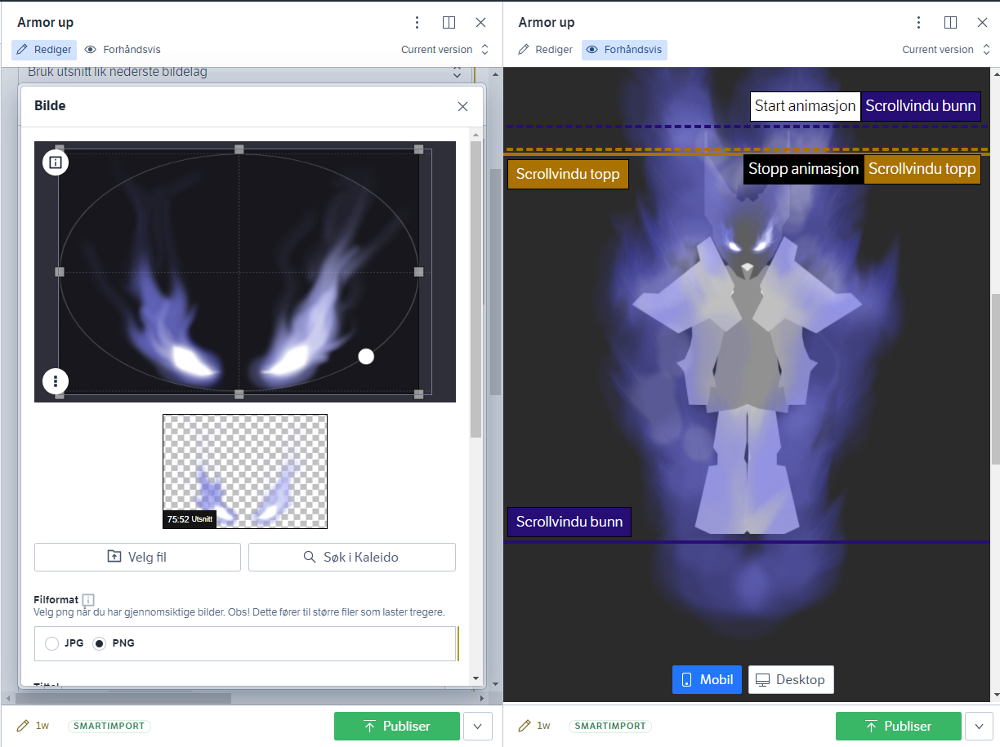
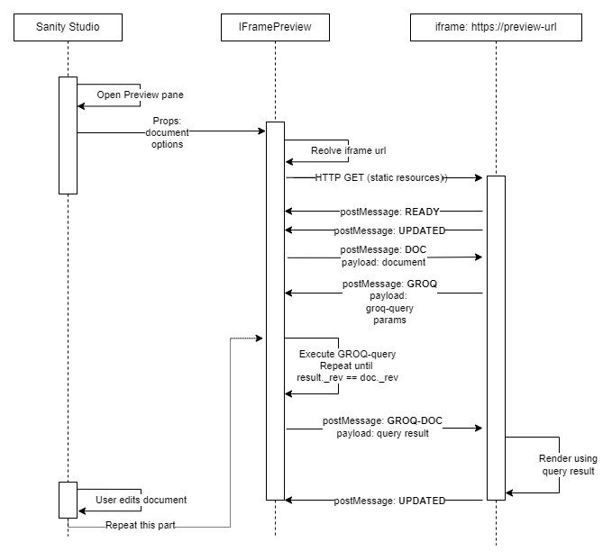

# @nrk/sanity-plugin-nrkno-iframe-preview

_This document assumes familiarity with [custom documents views in Sanity](https://www.sanity.io/docs/create-custom-document-views-with-structure-builder)._
_It builds on the [principles of nrkno-sanity](https://github.com/nrkno/nrkno-sanity-libs/blob/master/docs/nrkno-sanity-principles.md) and
[option driven design](https://github.com/nrkno/nrkno-sanity-libs/blob/master/packages/sanity-plugin-nrkno-odd-utils/docs/option-driven-design.md)._

**nrkno-iframe-preview** provides a live-updated iframe preview component for Sanity Studio.

Queries are executed by Sanity Studio and passed to the iframe. 
The render-app in the iframe does _not_ need to listen for sanity client updates itself,
but rather to messages from parent window.

The app running in the iframe should use [`@nrk/nrkno-iframe-preview-api`](https://github.com/nrkno/nrkno-sanity-libs/tree/master/packages/nrkno-iframe-preview-api#nrknrkno-iframe-preview-api),
which allows it to specify a GROQ-query for the Studio to execute.

The result of the query will be sent to the iframe whenever the query
revision matches the studio revision (ie. whenever the data changes).

This means that the render app does not need to listen for changes itself, as
data flows directly from the Studio via iframe.postMessage.


_Figure 1: NRK image editor in the left pane, IFramePreview with desktopMinWidth configured in the right pane._

# Installation
In Sanity studio project run:

`npx sanity install @nrk/sanity-plugin-nrkno-iframe-preview`

This will install & add the plugin to sanity.json plugin array.

## At-a-glance

* Use IFramePreview component in studio structure view.
    * Configure with render-app preview-url.
    * Optionally configure desktopMinWidth.
* Use [nrkno-sanity-iframe-preview-api](https://github.com/nrkno/nrkno-sanity-libs/tree/master/packages/nrkno-iframe-preview-api#nrknrkno-iframe-preview-api) in the render-app.
    * Configure a groq-query (or just use document directly from Sanity Studio as is).
* Enjoy live-updated preview in Studio, with queries executed by the Studio on behalf of the render app.

## Usage


## Basic

Read [IFramePreviewBasicProps](src/components/basic/IFramePreviewBasic.tsx) jsdocs for config details.

At the most basic level, IFramePreview component can used as part of Sanity Studio StructureBuilder code when [adding a second view](https://www.sanity.io/docs/create-custom-document-views-with-structure-builder#1c1f58025b3a):
```ts
//deskStructure.ts
import React from 'react'
import S from '@sanity/desk-tool/structure-builder'
import { IFramePreview } from '@nrk/sanity-plugin-nrkno-iframe-preview'

export const getDefaultDocumentNode = ({schemaType}: any) => {
  if(schemaName === 'schema-should-have-iframe-preivew') {
    return S.document().views([
      S.view.form(),
      S.view.component(IFramePreview)
            .options({
              url: (doc: SanityDocument) => 'http://iframe-url.example', // (doc) => (string |Promise<string>)
            })
            .icon(EyeIcon)
            .id("preview")
            .title("Preview")
    ])
  }
}
```

## Responsive controls

When `desktopMinWidth` option is set, buttons for forcing iframe width using width & scale transform will be shown. This is useful if the target app has breakpoints for media queries that have vastly different layouts.

The value is the pixel breakpoint or desktop width.

```ts
S.view.component(IFramePreview)
      .options({
        url: (doc: SanityDocument) => 'http://iframe-url.example', 
        desktopMinWidth: 900
      })
```

## Controlling what gets sendt to the iframe

If we dont want the full document to be passed to the iframe during 'doc' events, 
we can provide a `mapDocument` option to transform the document before it gets sendt.

_Note:_ IFramePreview sends data to the iframe, _id & _eventType will always be appended.
These fields are used to implement the iframe-protocol and therefor cannot be changed (will be overwritten).

```ts
S.view.component(IFramePreview)
      .options({
        url: (doc: SanityDocument) => 'http://iframe-url.example',
        mapDocument: (document: SanityDocument) => ({id: document._id})
      })
```

### Customize display texts

Create a wrapper component, and provide `DisplayTextsContext`:

```tsx
import React from 'react';
import {
  defaultDisplayTexts,
  DisplayTexts,
  DisplayTextsContext,
  IFramePreview,
  IFramePreviewProps,
} from '@nrk/sanity-plugin-nrkno-iframe-preview';

const texts: DisplayTexts = {
  ...defaultDisplayTexts,
  iframeTitle: 'Changed preview title',
};

export function TranslatedIFramePreview(props: IFramePreviewProps) {
  return (
    <DisplayTextsContext.Provider value={texts}>
      <IFramePreview {...props} />
    </DisplayTextsContext.Provider>
  );
}
```

### Define preview component from schema

The above approach to document previews, where each schema gets a separate if-branch in getDefaultDocumentNode, goes counter to the [principles of nrkno-sanity](https://github.com/nrkno/nrkno-sanity-libs/blob/master/docs/nrkno-sanity-principles.md). It does not scale in a codebase with a large amount of schemas,
and does not optimzie for deletion (schema one in one file, preview config in another).

We can enable iframe preview directly in the schema definition, more along the lines of [option driven design](https://github.com/nrkno/nrkno-sanity-libs/blob/master/packages/sanity-plugin-nrkno-odd-utils/docs/option-driven-design.md) though.

Alternativly, take a look at @nrkno/sanity-plugin-nrkno-schema-structure.

Assume sanity.json with parts structure implemented like so
```json
{
  "name": "part:@sanity/desk-tool/structure",
  "path": "./structure.ts"
}
```

```ts
// someSchema.tsx
export const someSchema = {
  type: 'document',
  title: 'Some doc',
  livePreviewComponent: IFramePreview,
  fields: [/** omitted */]
}

// structure.ts
export function editAndPreviewViews<T>(previewComponent: PreviewComponent<T>) {
  return [
    S.view.form().title("Edit").icon(EditIcon),
    S.view
      .component(previewComponent)
      .icon(EyeIcon)
      .id("preview")
      .title("Preview"),
  ];
}

// https://www.sanity.io/docs/structure-builder-reference#97e44ce262c9
export const getDefaultDocumentNode = ({ schemaType }: any) => {
  const matchingTypes = S.documentTypeListItems()
    .filter((listItem: any) => listItem.spec.schemaType.name === schemaType)
    .map((listItem: any) => {
      const previewComponent = listItem.spec.schemaType.livePreviewComponent;
      if (previewComponent) {
        // add iframe preview using schema-provided component
        return S.document().views(editAndPreviewViews(previewComponent));
      }
      return S.document();
    });
  return matchingTypes.length ? matchingTypes[0] : S.document();
};

export default () => S.list().items(/* your structure */)
```

## Sequence diagram for dataflow


_Figure 2: Sequence diagram for dataflow between Sanity Studio and the iframe_

## Develop

### Build
`npm run build`

### Test

In this directory

```bash
npm run build
npm link
```

```bash
cd /path/to/my-studio
npm link @nrk/sanity-plugin-nrkno-iframe-preview
```

Note: after running npm link, tests will start failing because of the way
React versions are handles during symlinking. Run `npm run init` from root directory to fix.

# Develop

This plugin is built with [sanipack](https://www.npmjs.com/package/sanipack).


