# Core concept: Option driven design
This document details the recommended way of creating custom editor features in
nrkno-sanity.

It is the philosophical underpinning of most React-components in the codebase, and provides the reasoning for using "option driven design" in Sanity. 

## Introduction
Sanity uses an input component for each field in a document. 
Each field-type (string, number, object etc.) use a default implementation, unless overridden by a
[custom input component](https://www.sanity.io/docs/custom-input-widgets).

Typically, we can create custom components in two ways:

* provide a React-component to inputComponent in the schema
* use schema options, and resolve them in input-resolver.ts

```ts
const schemaOrField = {
  name: 'schemaOrField',
  inputComponent: SomeReactComponent,
  options: {
    someCustomOption: true
  }
}
```
*Example 1: simple schema-definition with inputComponent and options.* 

## Caveats with `inputComponent`

It is hard to reuse and compose common functionality with inputComponent.
For reusable feature-components, we have to use additional components to compose these features.

Furthermore, React-components are not "discoverable" in the codebase. Developers have to know about existing components, prior to using them. 
When creating a schema, autocomplete will not list available components in nrkno-sanity. 

Therefore, it is recommended to only use ìnputComponent in schemas and fields that are specific to a feature.
If the inputComponent is at all generic in nature, we should prefer using "option driven" components.

## How Sanity works: Resolving input components
To understand how options allows us to compose reusable features, we have to understand how Sanity creates the editor UI for a schema.

First, create-schema.ts is defined in sanity.json. 
From there,Sanity compiles a registry of schemas, which are used to populate the Content Studio UI.

When opening a document in the studio, Sanity sends the document-value and schema to FormBuilderInput.
FormBuilderInput is a built-in Sanity component. In short, it uses the value & schema to construct the editor view.

For every field in the schema, FormBuilderInput resolves input components using input-resolver.ts.
NRK have defined a input-resolver implementation in sanity.json. 
 
Resolution goes as follows:

* If input-resolver.ts returns a component, use it.
* Else, if input-resolver.ts returns undefined, use inputComponent. 
* Otherwise, use the default input component for that field-type. For example, StringInput for string fields.

At a glance, this might not seem like much, but it alludes to a really powerful design paradigm:

What happens when an input component itself uses FormBuilderInput? 

Well, we get a recursive call to input-resolver.ts.
This is problematic, because it will lead to an infinite recursion; FormBuilderInput will resolve 
to the same component over and over.

But, what happens if we stop the recursion, by modifying the schema before sending it to FormBuilderInput?

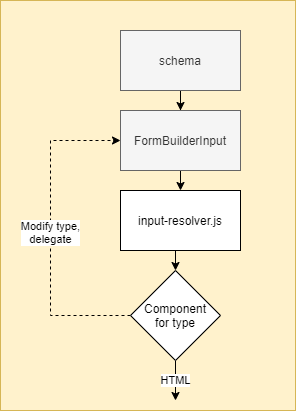

*Figure 1: Using FormBuilderInput in a custom component*

### Recursive example

Say we have to following code:

```tsx
// input-resolver.js
function resolveInput(schema) {
  if(schema.options?.custom) {
    return CustomComponent
  }
}

// a field-defintion in a schema
const stringField = {
  name: 'someField',
  type: 'string',
  options: {
    custom: true
  } 
}

// CustomComponent.tsx
function CustomComponent(props) {
  return <>
    <div>Super custom</div>
    {/* passthrough props, includes props.type (type == schema in this context)*/}
    <FormBuilderInput {...props} />
  </>
}
```
*Example 2.1: Custom component enabled by option*

As written, this will lock up the browser: 

* FormBuilderInput will call input-resolver.js using props.type (schema)
* input-resolver.js will match type.options.custom -> return CustomComponent
* FormBuilderInput outputs CustomComponent
* Custom component outputs FormBuilderInput. Since the schema is unchanged,
we are now in an infinite loop:

```tsx
<FormBuilderInput>
  <CustomComponent>
    <FormBuilderInput>
      <CustomComponent>
        <FormBuilderInput>
          {/* infinite recursion here... */}
        </FormBuilderInput>
      </CustomComponent>   
    </FormBuilderInput>
  </CustomComponent>  
</FormBuilderInput>
```
*Example 2.2: Infinite FormBuilderInput recursion*

We can break the loop, however, by removing the custom option in CustomComponent:

```tsx
function CustomComponent(props) {
 
  // useMemo so we only recreate type when props.type changes
  const type = useMemo(() => ({
    ...props.type,
    options: {
      ...props.type.options,
      custom: undefined
    }
  }), [props.type]);
  
  return <>
    <div>Super custom</div>
       {/* passthrough props, but override props.type with our modified type */}
    <FormBuilderInput {...props} type={type}/>
  </>
}
```
*Example 2.3: Breaking the loop!*

Now, we will get the following component structure:

```tsx
<FormBuilderInput>
  <CustomComponent>
    <FormBuilderInput>
      <StringInput/>
    </FormBuilderInput>
  </CustomComponent>  
</FormBuilderInput>
```
*Example 2.4: FormBuilderInput that resolves to default input component*

which gives us this approximate HTML:

```tsx
<div>Super custom</div>
<label>
  <input/>
</label>
```
*Example 2.5: HTML for a field with custom option*

In other words, we have made our "Super custom" feature composable with built in Sanity inputs. That's very powerful!

## Going deeper
The above explanation glosses over a couple of issues:

First, FormBuilderInput manages focus using react-effects. When we nest FormBuilderInputs for the same input-field, focus will jump around as input-effects fire indefinitely.

To fix this, we have a custom NestedFormBuilder component. 
NestedFormBuilder is an extension of FormBuilderInput. It should be used whenever we create "decorator" components like the one described above. 
For details, take a look at the NestedFormBuilder-jsdocs.

Another issue is that schema-types in Sanity are recursive: A schema can refer to another schema, by name:
```tsx
const namedSchema = {
  type: 'string',
  name: 'named-string-schema',
  options: {
     custom: true
  }
}

const schemaUsingNamed = {
  type: namedSchema.name,
  name: 'refer-to-named-string-schema-type'
}

// At runtime, when used as props.type in custom componets, schemaUsingNamed has this approximate json-structure:
const type = {
  name:  'refer-to-named-string-schema-type',
  type: {
    name: 'named-string-schema',
    options: {
      custom: true 
    },
    type: {
       name: 'string'
    }
  }
}

```
*Example 3: A type referring to another type, by name*

Notice how type-fields are nested here: It is not enough to remove `type.options.custom`, we also have to remove it from `type.type.options.custom`, to avoid recursion!

To solve this, odd-utils provide reusable hooks & functions for modifying a schema-type. 
For instance, useUnsetOption removes a named option from a schema-type, recursively.

### A better way 

Knowing this, lets rewrite the CustomComponent like so:

```diff
function CustomComponent(props) {
  // prevent NestedFormBuilder -> FormBuilderInput from recursivly resolving props.type to CustomComponent
+ const type = useUnsetOption(props.type, 'custom');
  
  return <>
    <div>Super custom</div>
+   <NestedFormBuilder {...props} type={type}/>
  </>
}
```

## Making it all discoverable
In a standard Sanity Studio, options are just as difficulty to discover as React-components.

However, nrkno-sanity has [typesafe schema helper functions](../nrkno-sanity-typesafe-schemas/README.md) to levitate this.
These allow us to add options to our typescript types, which will appear as autocomplete suggestions when creating schemas.

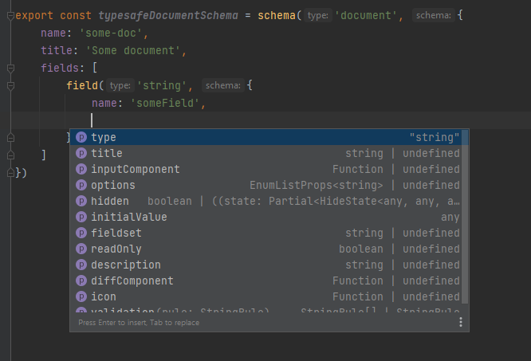

*Figure 2: schema autocompletion in action, thanks to `schema` and `field`*

When creating a new, reusable component in nrkno-sanity, follow this approach:

* Add the new option with some jsdoc to relevant Typescript-type(s) 
  * Options that apply to all schemas and fields are set in ICommonOpts
  * New Typescript-interfaces should be added to IAllExtensionOptions. 
    This type is used to provide type-safety in input-resolver.ts. 
* Create the input-component in a directory under `src/components` or `src/features`
  * Remove option by name, using `useUnsetOption(props.type, 'option-by-name')`
  * Pass the modified type to `NestedFormBuilder`
* In input-resolver.ts, return your component when the incoming type has the new option present.
  * Remember that input-resolver.ts can be invoked multiple times when we have multiple options. 
    In most cases, the order of option-resolution is not important, but if it is, this file is the place to determine order. 

Now, the CustomComponent is 100% composable with other options and features in Sanity!

```tsx
// src/types/schema/common.ts
export interface ICommonOpts {
  /** Set to any string to enable CustomComponent */
  custom?: string 
}

// src/components/custom-component/CustomComponent.tsx
import React, { forwardRef, Ref } from 'react';
import { useUnsetOption, NestedFormBuilder } from '@nrk/sanity-plugin-nrkno-odd-utils';

export const CustomComponent = forwardRef(function CustomComponent(props,  ref) {
  // if we need the option value in the component,
  // we should retrieve it from props.type.option first
  const type = useUnsetOption(props.type, 'custom');
  return <NestedFormBuilder {...props} ref={ref} type={type} />;
});

// src/input-reslover.ts 
export default function resolveInput<
  T extends SchemaType & { inputComponent?: any; titleTooltip?: any, options?: any }
  >(type: T) {
  const options: IAllExtensionOptions | undefined = type.options;
  if(options.custom) {
    return CustomComponent
  }
}

```
*Example 4: Minimal example illustrating how to add support in nrkno-sanity for an option driven custom-component.*

## Example usage
Some example features in nrkno-sanity, where these principles are used:

### Spellcheck
Adds a language selector & spellcheckbutton for document wide spellcheck.

`document.options.spellcheck: true`

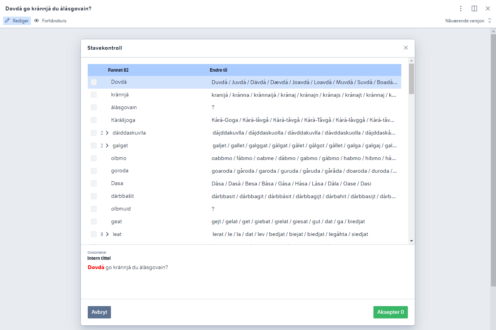


### Show array index
Show 1-based index on array items, or an index generated by a function.

`arrayField.options.showCount: true | fn`


### Show array count
Show item count for arrays - modifies schema-type title so it includes props.value.length

`arrayField.options.showCount: true`

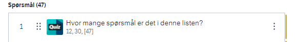


### Paginated arrays
Makes an array paginated.

`arrayField.options.pageSize: 10`

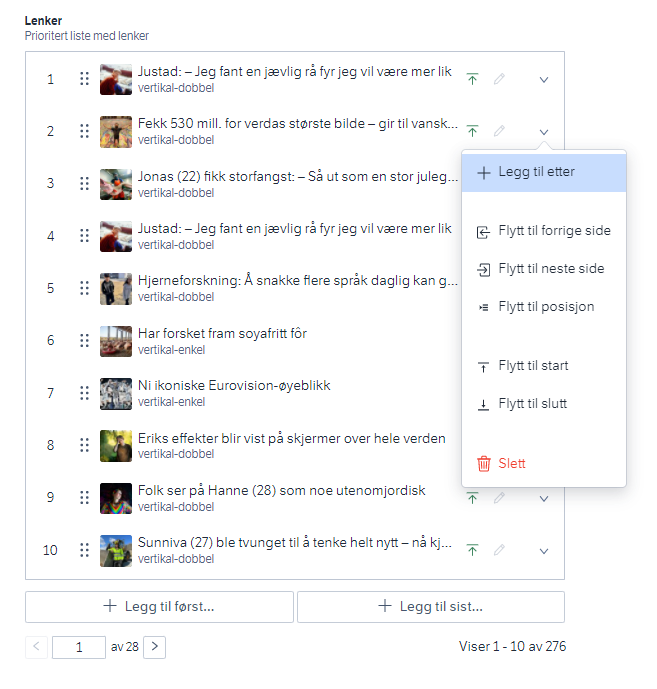

### Inline edit array items
Makes array items editable inline in an array (no modal).

```ts
arrayField.options: {
  editModal: 'inline',
  hideDelete: (itemProps) => itemProps.index === 0, // make first item undeletable
}
```

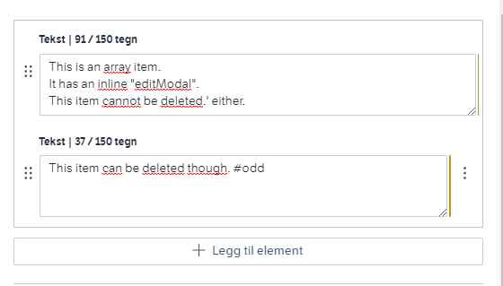

Also shows some other options on the block field:

```ts
arrayField.options: {
  blockHeight: '80px', // reduce the height of the block-text field
  showTextCount: { chars: { max: 280 } }, // show character count in the field-title
}
```

### Title tooltips
Adds an info-icon with tooltips into the field-title.
Not implemented as an option, but directly on schema, so it can be placed under
title in the schema.

```tsx
field.titleTooltip: {
  tooltip: (<div>
              Listetittel i Sanity.<br />
              Brukes som tittel i Polopoly ved smartimport.
            </div>),
  maxWidth: 350,
}
```
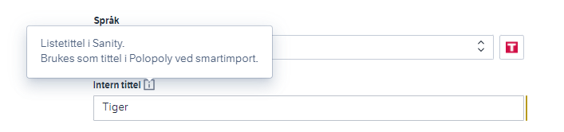


### Smartimport
Adds document action and document badge for "Smartimport".
Shows status-panel on the top of the document with key info about import status.

`document.options.smartimport: true`

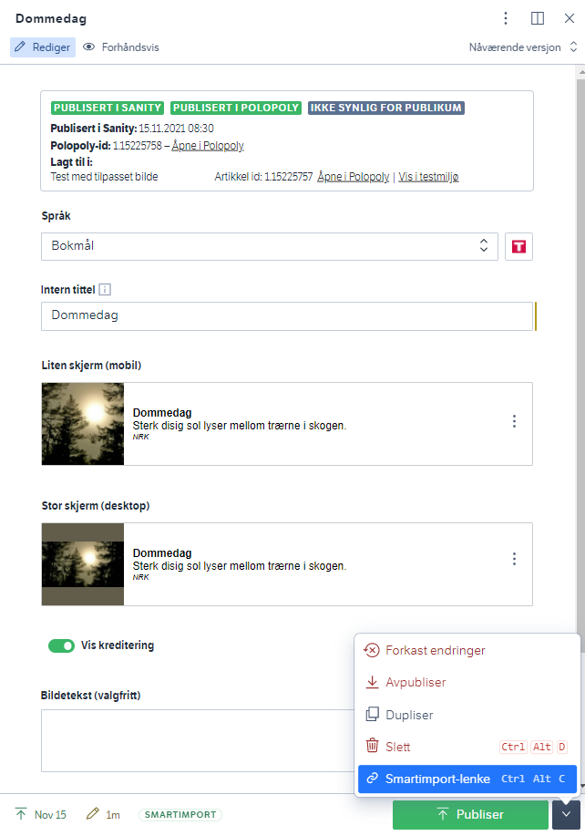

### Preview component

Configures StructureBuilder / default structure node for the document to enable split pane
with preview component.

`document.options.livePreviewComponent: CustomPreviewComponent`

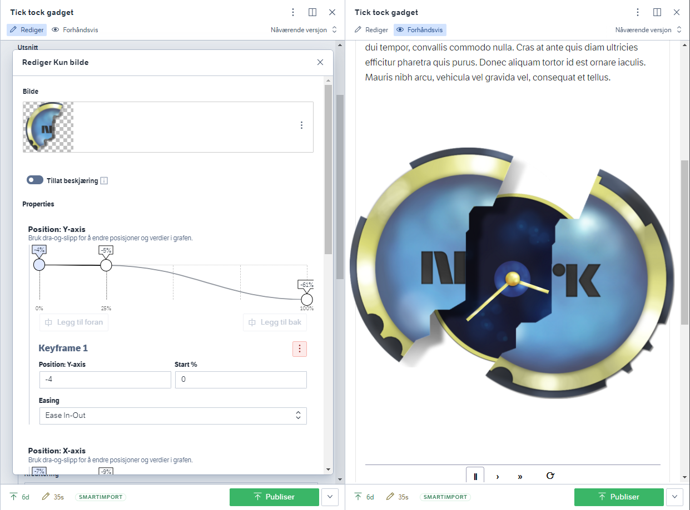

### Structure through options

Document-schemas can be placed in the Sanity structure using options. Supports a slew of
configuration-types, to support a wide array of usecases.

```ts
document.customStructure: {
  type: 'document-list',
  group: 'animation',
},
```

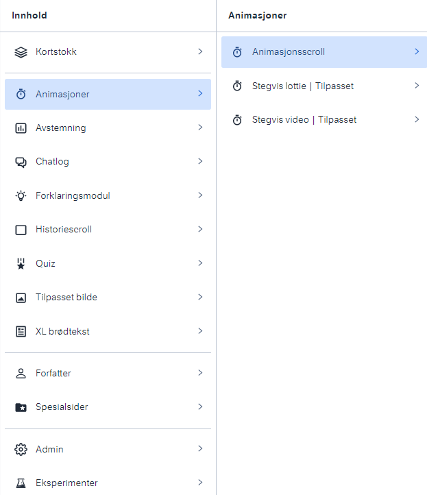

## Number slider

Renders number input as a slider.

```ts
numberField.options.range {
          min: 0,
          max: 100,
          step: 1,
        }
```

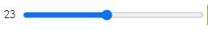
