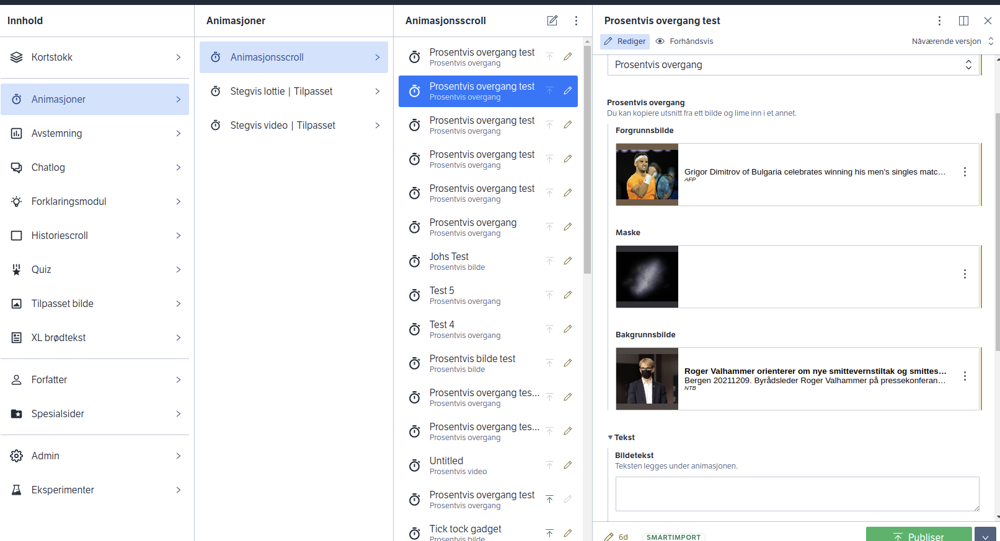

# @nrk/sanity-plugin-nrkno-schema-structure

_This document assumes familiarity with [Sanity StructureBuilder](https://www.sanity.io/docs/structure-builder-introduction)._

**nrkno-schema-structure**
 allows schemas to use a declarative approach to Sanity Studio structure, by configuring a `customStructure` field in `document` schemas.

This lib uses and extends DocumentSchema from [nrkno-sanity-typesafe-schemas](../nrkno-sanity-typesafe-schemas/README.md). It is recommended to use @nrk/nrkno-sanity-typesafe-schemas when creating schemas,
so this lib can be used in a typesafe manner.

## At-a-glance



_Figure 1: A document-list for schema type "Animasjonsscroll", placed in "Animasjoner" group, using the below schema-driven config._

```diff
schema('document', {
  type: 'animasjonsscroll',
  title: 'Animasjonsscroll',
+ customStructure: {
+  type: 'document-list',
+  group: 'animation',
+ },
  fields: [
   /* omitted */
  ]
})
```

At the time of writing, NRK organize 60+ document schemas using this approach.

## Overview

The basic idea is to have schemas declare _what_ should be placed _where_ in a directory-like structure, without knowing _how_ it is done. 

**nrkno-schema-structure** finds all schemas with `customStructure` and creates a structure-registry. Groups can be obtained by name, and
contain everything that where decoratively added to them. Groups can then be composed into any
[Sanity StructureBuilder](https://www.sanity.io/docs/structure-builder-introduction)
hierarchy.

Groups can contain subgroups (S.listItem), document-lists (S.documentTypeList), document-singletons (S.document), custom-builders (ad-hoc S.listItem builders) and dividers (S.divider).

All of these will be sorted by a sort-key (sortKey ?? title), making it possible to
compose complex structure hierarchies locally from each schema.

The library provides support for managing the "Create new document" menu, by filtering out schemas that should not appear there.

All custom structures support the `enabledForRoles` option out-of-the-box, which makes it simple to hide schemas form users without access.

The declarative nature of this approach aligns well with [principles of nrkn-sanity](../../docs/nrkno-sanity-principles.md) and
[option driven design](../sanity-plugin-nrkno-odd-utils/docs/option-driven-design.md)

**nrkno-schema-structure** also supports defining views (split panes) in a declarative manner, using
`customStructure.view`.

The final structure is still fully customizable by each Studio, and the
library can easily be composted with existing structure code. The API provides a list
of all ungrouped schemas, so that they can be placed wherever it makes sense.

# Installation
In Sanity studio project run:

`npx sanity install @nrk/sanity-plugin-nrkno-schema-structure`

This will run yarn install & add the plugin to sanity.json plugin array.

# Usage

This lib requires some setup:

## Create typesafe root groups

First we define typesafe groups.
Create structure-registry.ts:

```ts
import {
  createCustomGroup,
  initStructureRegistry,
} from '@nrk/sanity-plugin-nrkno-schema-structure';

export const customGroups = {
  format: createCustomGroup({
    urlId: 'group1', // same as id in strucure builder
    title: 'Group 1',
   // schemas in this group (or subgroups) can be created in the top menu
    addToCreateMenu: true, 
  }),
  animation: createCustomGroup({
    urlId: 'group2',
    title: 'Group 2.',
    icon: () => 'II',
   // schemas under this group must be created via the document list
    addToCreateMenu: false,
  }),
} as const;

type CustomGroups = typeof customGroups;

declare module '@nrk/sanity-plugin-nrkno-schema-structure' {
  // Here we extend the GroupRegistry type with our groups.
  // This makes groupId typesafe whe using the structure registry
  // eslint-disable-next-line @typescript-eslint/no-empty-interface
  interface GroupRegistry extends CustomGroups {}
}

export const structureRegistry = initStructureRegistry({
  groups: Object.values(customGroups),
  locale: 'no-no' // locale used for sorting
});
```

## Configure "Create new" menu

Then configure the [create new document menu](https://www.sanity.io/docs/initial-value-templates#56b4073ca73a) :
```ts
import { createInitialValueTemplates } from '@nrk/sanity-plugin-nrkno-schema-structure';
import { structureRegistry } from './structure-registry';

const templates = createInitialValueTemplates(structureRegistry.getGroupRegistry());

export default [...templates];
```

## Configure Studio Structure
Then configure the Studio structure:

```ts
import { StructureBuilder as S } from '@sanity/structure';
import { isDefined } from '../types/type-util';
import { authorStructure } from '../features/author/author';
import { structureRegistry } from './structure-registry';

const { getGroupItems, getGroup, getUngrouped } = structureRegistry;

export const getDefaultDocumentNode = ({ schemaType }: { schemaType: string }) => {
  // adds support for customStructure.views in schemas
  return structureRegistry.getSchemaViews({ schemaType }) ?? S.document();
};

// Sanity supports async structure
export default async () => {
  // Compose the Sanity Structure.
  // Can be combind with any amount of manual S.itemList nodes.
  const items = [
    // schemas with customStructure.group: 'group1' are contained in this group. 
    structureRegistry.getGroup('group1'),
          
   // schemas without group is part of the ungrouped list, one listItem per schema (hence the spread)      
   S.divider(),
   structureRegistry.getUngrouped(),
   S.divider(),
          
   // schemas with customStructure.group: 'group2' are contained in this group
   // notice the use of getGroupItems (as opposed to getGroup). 
   // This inlines the direct children of the group.
   structureRegistry.getGroupItems('group2')
  ].flatMap(i => i); // flatmap to flatten everyting 

  return S.list().title('Content').items(items);
};
```

## Use customStructure in schemas

Finally, we can start organizing schemas directly from the schema definition.

In your schema:

```ts
import { schema } from '@nrk/nrkno-sanity-typesafe-schemas';

export const mySchema = schema('document', {
  type: 'my-schema',
  title: 'My schema',
  customStructure: {
    type: 'document-list',
    // this group will be typesafe. Ie, autocomplete and 'group3' will give compileerror
    group: 'group1', 
  },
  fields: [
   /* omitted */
  ]
})
```

# Supported structures

`customStructure` supports a handful of different usecases, most of them
controlled by the optional type-field.

## Standard documents

Document-schemas without `options.customStructure` are available directly in the root content list.

_Documents without customStructure appear in structureRegistry.getUngrouped() using the default S.documentTypeList._

## Group

Groups (root groups) contain every schema that has been configured to appear in them.
Groups can have subgroups, which in turn can have subgroups.

These are static, and must be provided when initializing the structure registry.
See the Usage section above for how to configure them in a typesafe manner.


_Groups are accessed using structureRegistry.getGroup('groupId') and appear as S.listItems. Subgroups cannot be accessed directly._

## Document list

Puts the schema in a S.documentTypeList, under the provided group.

```ts
const partialSchema = {
  customStructure: {
    type: 'document-list',
    group: 'group1', 
  }
}
```
_This schema appears in structureRegistry.getGroup('group1') as a S.documentTypeList._

## Document singleton

The schema will only list documents with the configured ids. Maps to S.document.

```ts
const partialSchema = {
  customStructure: {
   type: 'document-singleton',
   group: 'help',
   documents: [
    { documentId: 'user-help', title: 'Sanity-help' },
    { documentId: 'developer-help', icon: () => 'Dev' , title: 'Developer-help' },
   ],
  },
}
```
_This schema appears in structureRegistry.getGroup('group1') as two S.document nodes._

## Custom builder

Use this if you want a handwritten structure for the schema.

```ts
const partialSchema = {
   customStructure: {
      type: 'custom-builder',
      group: 'group1',
      listItem: () =>
        S.listItem()
          .id('url-path')
          .title('Some custom thing')
          .child(S.documentList().id('some-schema')),
    }
}
```
_This schema appears in structureRegistry.getGroup('group1') as the provided structure._

## Manual

Totally removes the schema from the structure registry.

This is useful if we want place the schema anywhere using regular S.builder functions,
any way we want.

```ts
const partialSchema = {
  customStructure: {
    type: 'manual'
  }
}
```
_This schema appears in the structureRegistry.getManualSchemas()_

## Subgroup
Subgroups are ad-hoc groups that can be provided to any other custom structure.
Subgroups must be used alongside the group parameter in customStructure.

Create subgroups constants:

```ts
import {SubgroupSpec} from '@nrk/sanity-plugin-nrkno-schema-structure'

export const mySubgroup: SubgroupSpec = {
  urlId: 'mySubgroup',
  title: 'Subgroup',
};

export const nestedSubgroup: SubgroupSpec = {
 urlId: 'nested',
 title: 'Nested Subgroup',
 // its is also possible to prepopulate a subgroup with custom-builders
 // customItems: [] 
};
```
_Subgroups appear as S.listItems._

Then use it in a schema.customStructure:

```ts
import { schema } from '@nrk/nrkno-sanity-typesafe-schemas';

export const mySchema = schema('document', {
  type: 'my-schema',
  title: 'My schema',
  customStructure: {
    type: 'document-list',
   // this document-list will be placed under Group 1 -> Subgroup -> Nested Subgroup -> My schema
   group: 'group1', 
   subgroup: [mySubgroup, nestedSubgroup]
  },
  fields: [
   /* omitted */
  ]
})
```
_This schema appears nested in subgroups under structureRegistry.getGroup('group1') as S.documentTypeList_

Subgroups _can_ technically be defined inline, but its better to use a constant to avoid
multiple subgroups using the same urlId within the same group (undefined behaviour).

## customStructure without group

Some nrkno-sanity-structure features do not require a group.

In this case they will affect how the schema appears when accessed
from getUngrouped().

```ts
const partialSchema = {
  customStructure: {
   type: 'document-list',
   title: 'Special thing',
   icon: () => 'Custom icon',
   omitFormView: true,
   views: [S.view.component(SpecialForm).title('HyperEdit')],
   enabledForRoles: ['developer'],
   addToCreateMenu: false,
   sortKey: 'xxxxxxWayLast',
   divider: 'below'
  }
}
```
_This schema appears in structureRegistry.getUngrouped() as S.documentTypeList._

## Dividers

Its possible to have dividers above or below a schema entry using `customStrucutre.divider: 'over' | 'under' | 'over-under'`

If exact location is required, 
playing around with sort key might be required.

```ts
const partialSchema = {
  customStructure: {
    type: 'document-list',
   divider: 'below', 
  }
}
```
_This schema appears in structureRegistry.getUngrouped() as S.documentTypeList followed by S.divider._

## Not supported at this time

Parametrized initial value templates.

# Develop

This plugin is built with [sanipack](https://www.npmjs.com/package/sanipack).

### Test

In this directory

```bash
npm run build
npm link
```

```bash
cd /path/to/my-studio
npm link @nrk/sanity-plugin-nrkno-schema-structure
```

Note: due to potentially conflicting Sanity versions when linking,
you should provide StructureBuilder as an argument to the api in the Studio:

```ts
import { StructureBuilder } from '@sanity/structure';

export const structureRegistry = initStructureRegistry({
  groups: Object.values(customGroups),
  StructureBuilder, // add this while testing with npm link
});

```