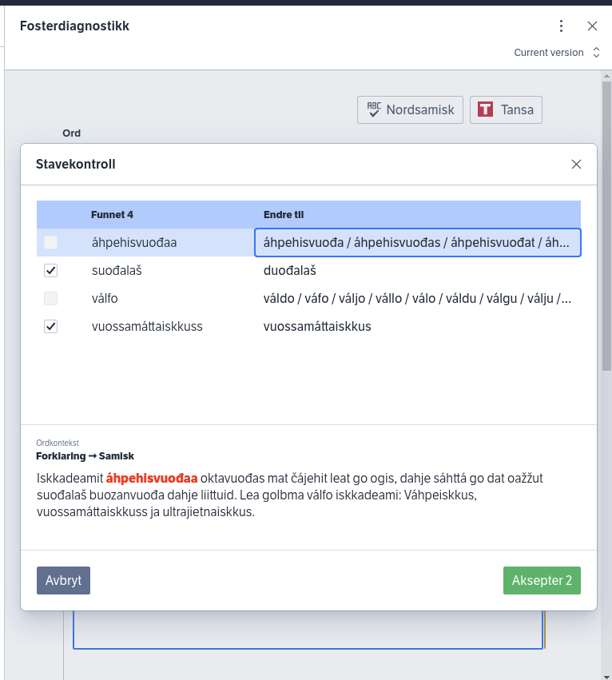
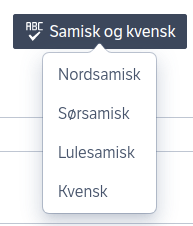
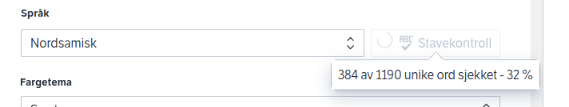
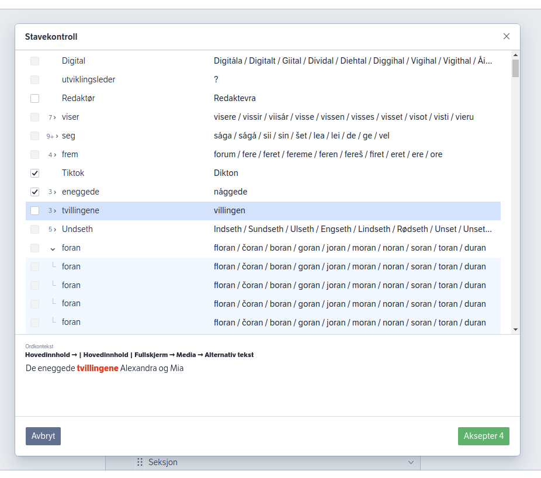
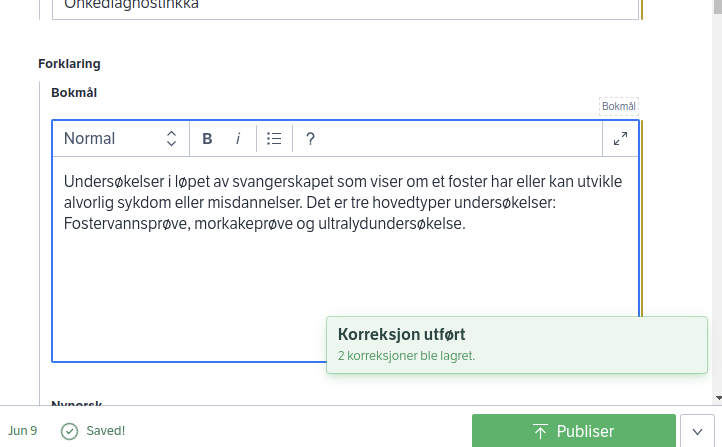
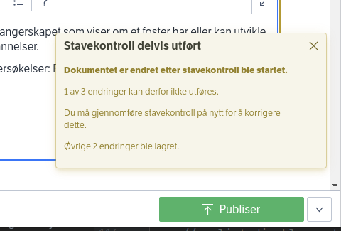
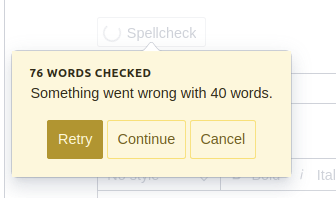
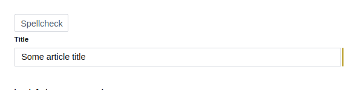
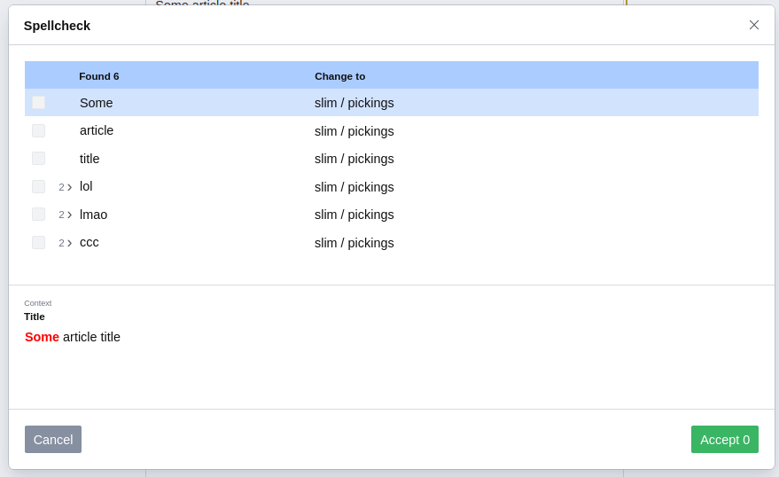

# @nrk/sanity-plugin-nrkno-spellcheck

**nrkno-spellcheck** is a full document spellchecker for Sanity Studio.

It _finds_ and _replaces_ words based on the document schema configuration.

It does _not_ perform _actual_, word-by-word checking; you must bring your own spellcheck service.



_Figure 1: nrkno-spellcheck in action. Here, northern sami is used for spellcheck (Divvun) and the UI is translated to norwegian bokmål._

## Main features

### Configurable

Languages and spellcheck service is configured using ConfiguredSpellcheckButton.

Display texts are configured using typesafe react-context.

Multiple languages can be used in the same document. Fine-grained control over what gets spellchecked is controlled by `options.spellcheck: '<language code>'` on fields.



_Figure 2: Configurable spellcheck button with support for one or more languages._

### Checks the full document

**nrkno-spellcheck** traverses the document and finds all fields eligible for spellcheck.
Field values are parsed into words, and all words are processed by a user-provided spellcheck service, in batches.

Batch size & max parallel requests can be configured.



_Figure 3: Finds all unique words in a document, and send them in batches to a configurable spellcheck service._

### Dialog for bulk-editing words

Words deemed incorrect by the spellcheck service are shown in a modal dialog. For each entry, a singular replacement must be provided, either from dropdown suggestions or user-input.

Incorrect words that appear multiple times are grouped and can be edited en-masse (collapsed), or individually (expanded).

A context panel at the bottom of the dialog shows the field-path and surrounding text for the currently selected word.

Only words that are checked will be corrected when hitting "Accept".



_Figure 4: Spellcheck dialog for showing suggestions and correcting words._

### Document updates

The document is patched only when clicking "Accept". A toast will inform about the result.



_Figure 5: Toast showing number of corrections applied._

Because the document can change while a users is editing corrections, a best-effort approach to edits is used. Only patches that can be safely applied to a field, array-item or portable-text block will be committed. 

Eg: If a title field and two blocks in a portable text field are corrected, and one of the text blocks was concurrently edited, only the title and second text block would be patched by nrkno-spellchecker.



_Figure 6: Toast showing some discarded corrections._

### Error handling

When and if the configured spellcheck service throws an error during processing,
the user will be informed. If the user choose to retry, only failed batches will be reprocessed.



_Figure 7: Popover showing that some spellcheck service batches failed._


# Installation

## Yarn

In Sanity studio project run:

`npx sanity install @nrk/sanity-plugin-nrkno-spellcheck`

This will run yarn install & add the plugin to sanity.json plugin array.

## npm

`npm install --save @nrk/sanity-plugin-nrkno-spellcheck`

Add "@nrk/sanity-plugin-nrkno-spellcheck" to "plugins" in `sanity.json` manually.

# Usage

It is recommended to use this library with 
[@nrk/sanity-plugin-nrkno-odd-utils](https://github.com/nrkno/nrkno-sanity-libs/blob/master/packages/sanity-plugin-nrkno-odd-utils),
so the built-in sanity document component can be easily decorated with a spellcheck button.

## Basic setup

Creates and configures ConfiguredSpellcheckButton with default the default word-parser and a dummy spellcheck-service.

Given the following dummy-spellcheck-service:

```ts
//dummy-spellcheck-service.ts
import {
  Language,
  SpellcheckResponse,
  SpellcheckService,
} from '@nrk/sanity-plugin-nrkno-spellcheck';

export const dummyLanguage = {
  code: 'dummy',
  title: 'Dummy language',
}

const suggestions = ['slim', 'pickings'];

export const spellcheckService: SpellcheckService = async function dummy(
  words: string[],
  language: Language
): Promise<SpellcheckResponse[]> {
  return words
    .filter((word) => !suggestions.includes(word))
    .map((word) => ({ word, suggestions}));
};

``` 

Create the following React component:
```tsx
import React, { forwardRef, Ref } from 'react';
import { ObjectSchemaType, SanityDocument } from '@sanity/types';
import { NestedFormBuilder, unsetInputComponent } from '@nrk/sanity-plugin-nrkno-odd-utils';
import {
  CachedSpellchecker,
  ConfiguredSpellcheckButton,
  createWordParser,
  defaultDisplayTexts,
  DisplayTexts,
  DisplayTextsContext,
} from '@nrk/sanity-plugin-nrkno-spellcheck';
import { dummyLanguage, spellcheckService } from './dummy-spellcheck-service';

// running spellcheck twice for the same language will use cached suggestions
// this instance can be reused between components
const spellchecker = new CachedSpellchecker({ spellcheckService });

// default: words less than 3 letters, in all caps or with numbers are skipped
const wordParser = createWordParser(/*{ config is optional }*/);

export const DocumentWithSpellcheck = forwardRef(function Language(
  // taking some liberties with typing for the example
  props: { value: SanityDocument; type: ObjectSchemaType } & any,
  ref: Ref<any>
) {
  // We will delegate rendering to NestedFormBuilder,
  // so we must remove inputComponent to prevent infinite recursion.
  // See https://github.com/nrkno/nrkno-sanity-libs/blob/master/packages/sanity-plugin-nrkno-odd-utils/docs/option-driven-design.md
  const type = unsetInputComponent(props.type);
  if (!props.value) {
    return null;
  }

  return (
    <>
      <ConfiguredSpellcheckButton
        type={type}
        document={props.value}
        {/*Make sure language is memoized. Ie, DONT do this, as it will adversly trigger hooks in the spellchecker: language={{code: 'lang', title: 'Lang',}}*/}
        language={dummyLanguage}
        wordChecker={spellchecker.spellcheck}
        wordParser={wordParser}
      />
      {/* Let Sanity built in handle the rest, we just prepended the spellcheck button */}
      <NestedFormBuilder {...props} ref={ref} type={type} />
    </>
  );
});
``` 

Now use in schema as inputComponent:
```ts 
export const mySchema = schema('document', {
  /* omitted */
  inputComponent: DocumentWithSpellcheck,
  fields: [/* omitted */],
});
```

This should give us something like this:



Now, type in some text in a string, text or portable text field, then click the spellcheck button:



## Configure display texts

### DisplayTextsContext

The plugins supports i18s via typesafe context:
```tsx
// perhaps in a file seperate from the component
import {
  DisplayTexts,
  DisplayTextsContext,
} from '@nrk/sanity-plugin-nrkno-spellcheck';

export const displayTexts: DisplayTexts = {
  spellcheckButtonText: 'Custom spellcheck button text',
  
  // some entries must provide a function
  acceptButtonText: (acceptCount) => `OK ${acceptCount}`
  
  // compiler error here, since ALL entries must be provided
};
``` 

```tsx
// inside a component, use displayTexts as value in context
<DisplayTextsContext.Provider value={displayTexts}>
  <ConfiguredSpellcheckButton
    type={type}
    document={props.value}
    language={languages}
    wordChecker={spellchecker.spellcheck}
    wordParser={wordParser}
  />
  <NestedFormBuilder {...props} ref={ref} type={type} />
</DisplayTextsContext.Provider>

``` 

### Default display texts

Default display texts is available when only some texts need to be changed:

```tsx
import {
  defaultDisplayTexts,
  DisplayTexts,
} from '@nrk/sanity-plugin-nrkno-spellcheck';

const displayTexts: DisplayTexts = {
  ...defaultDisplayTexts,
  spellcheckButtonText: 'Custom spellcheck button text',
};
```


### ReactNode support

Texts can be any ReactNode. When returning JSX-elements, keep in mind that layout might break.

```tsx
import {
  defaultDisplayTexts,
  DisplayTexts,
} from '@nrk/sanity-plugin-nrkno-spellcheck';

const displayTexts: DisplayTexts = {
  ...defaultDisplayTexts,
  spellcheckButtonText: <span style={{background: 'blue'}}>Blue spellcheck</span>,
};
```

## Configure the word parser

Change any of the config parameters, defaults listed below:
```ts
const wordParser = createWordParser({
  ignoreWordsInAllCaps: true, 
  ignoreWordsWithNumbers: true,
  minWordLength: 3,
  splitOn: /[\s.,;:'"$#@!/*?{}()|[\]\\&^–\-+]/
});
```

## Configure spellcheck service 

Change any of the config parameters, defaults listed below:
```ts
const spellchecker = new CachedSpellchecker({
  spellcheckService,
  maxWordsPerRequest: 20, // max size of word-array sendt to spellcheckService
  maxConcurrentRequests: 5 // max number of concurrent invocations of spellcheckService
});
```

## Configure a schema to support multiple languages

To support multiple languages in the same document, fields in a document schema should be configured with 
`options.spellcheck: Language | Language[]` or `options.spellcheck: false`.

This is relevant, when providing Language[] array to ConfigureSpellcheckButton, or when
multiple spellcheck button are used.

Consider the following:

### Fields

All fields with a string _value_ are spellchecked.
This includes string, text, portable-text spans as well as user-defined types that are stored
as strings (json "string").

The following field-types that are stored as string will NOT be spellchecked however:

- A field with `options.spellcheck: false`
- A field with `options.spellcheck: <languageCode>`, where language code differs from the language being spellchecked
- Any field under root-type `slug`
- Any field under root-type `reference`
- `url`, `datetime` or `date` fields
- Any field under `block`-type `marks`, `markDefs`, `style` or `list`
- `string` or `text` fields with `options.list: []` defined
- span.text in blocks
- `text`-fields (when options.list is undefined)
- `string`-fields (when options.list undefined)

This might seem like a complicated list, but in general, this should "work as expected".

### About multi-language documents
When a document defines multiple languages, special care should be taken to add
`options.spellcheck: <languageCode>` or `options.spellcheck: false`to all string, text or portable-text fields. If a spellcheck options is NOT provided, the field will be spellchecked
in ALL languages.


## Opting out of the UI

Some spellchecker have their own UI. This library can still come in handy as a way to
fetch all spellchecked texts in a document and then later to commit all changes back into the document.

### getSpellcheckedValues

This function takes a document, its schema-type and a language.
It return an array-of-arrays that can be used to address replacements later.

```ts 
import { getSpellcheckedValues } from '@nrk/sanity-plugin-nrkno-spellcheck';

// Returns an array with one entry for every spellchecked field. 
// Every entry is an array of every span within the field
// Only portable text fields will typically have more than one entry.
const spellcheckValues: OffsetPathValue[][] = getSpellcheckedValues(doc, type, language);
```

### ReplaceOperation and useCommitReplaceOperations 

Replacing text in a document can be done by providing a ReplaceOperations[] array to
useCommitReplaceOperations-hook.

```ts
import {
  ReplaceOperation,
  useCommitReplaceOperations
} from '@nrk/sanity-plugin-nrkno-spellcheck';

const [replaceOps, setReplaceOps] = useState<ReplaceOperation[]>([]);

// whenever replaceOps changes, ie when setReplaceOps is invoked
// useCommitReplaceOperations will immideatly apply the replace operations to the document
// and call setReplaceOps([]).
useCommitReplaceOperations(doc, type, replaceOps, setReplaceOps);


// somewhere else, to trigger document replacements 
setReplaceOps([{/* replace operations */}])
```

# How it works
When ConfiguredSpellcheckButton is clicked the following happens:

1. `getSpellcheckedValues` finds all field-strings eligible for spellcheck for currently selected language, and makes them addressable as `OffsetPathValue`.
2. `OffsetPathValue[][]` are sent to `getMisspelledWords`. A `WordParser` splits all strings into words. The words are made addressable via offsets into the string they reside in.
3. All unique words are passed to `SpellcheckService`. When `CachedSpellchecker.spellcheck` is used, words are batched and sent to the spellcheck function. Words returned from `SpellcheckService` with suggestions are considered misspelled.
4. Misspelled words are grouped and the spellcheck dialog is opened.
5. After the user has made corrections and hits accept, all corrections are mapped to `ReplaceOperation`. 
6. `ReplaceOperation[]` is then consumed by `useCommitReplaceOperations`:
7. Now, the document is checked for changes. If a ReplaceOperation addresses a string that has changed since spellcheck started, it is discarded.
8. Any remaining ReplaceOperations are mapped to sanity patches. ReplaceOperations addressing the same string are merged into a single set-patch.
9. Finally, the patches are applied to the document and the
user is notified about the result in a toast.

# Usage at NRK

NRK uses this library to integrate with Divvun and Tansa spellchecker-apis.

The Divvun integration uses `ConfiguredSpellcheckButton` and simply provide a spellcheck service function that fetches suggestions from a divvun-server api.

The Tansa 4 integration:
* uses `getSpellcheckedValues` to find spellchecked text
* merges it all into one big, addressable string
* sends the string to the Tansa js-spellchecker UI/api 
* creates `ReplaceOperation[]` based on Tansa callbacks
* `useCommitReplaceOperations` to patch the document.


# Develop

In this directory

```bash
npm run build
npm link
```

```bash
cd /path/to/my-studio
npm link @nrk/sanity-plugin-nrkno-schema-structure
```


This plugin is built with [sanipack](https://www.npmjs.com/package/sanipack).
